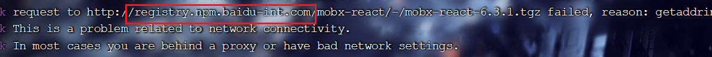
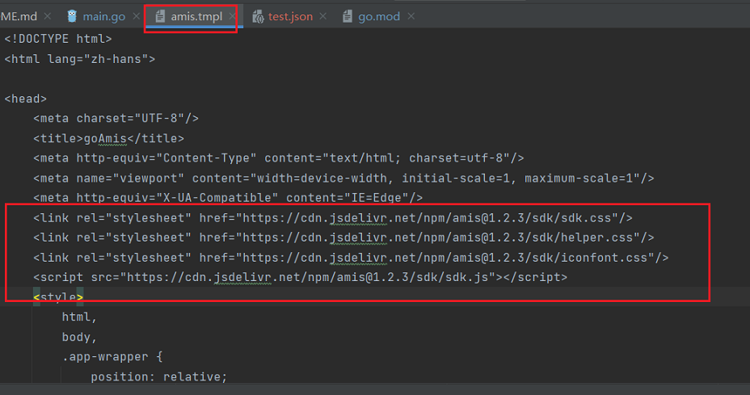
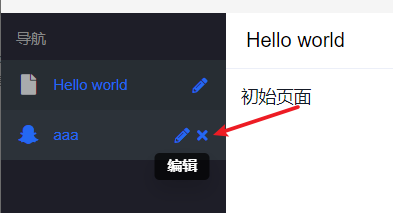
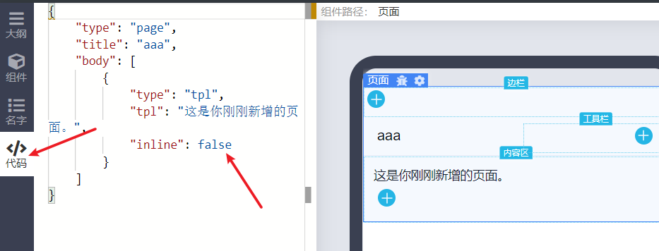
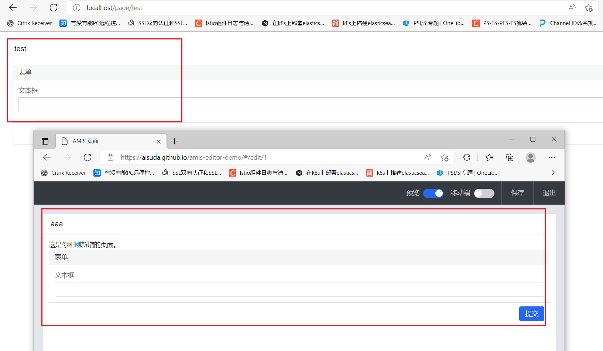
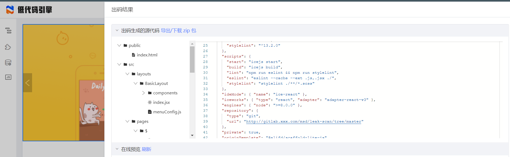
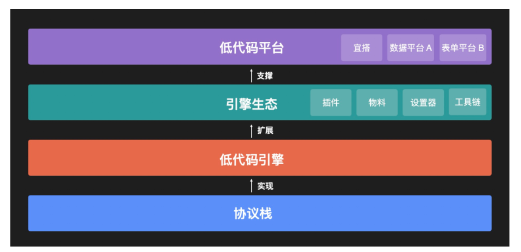

## 背景

```
转载自 https://juejin.cn/post/7005483831998283812
```

## 什么是低代码开发

```
所谓低代码开发，即无需编码或只需少量代码就可以快速生成应用程序。
也就是说，企业的应用开发通过“拖拉拽”的方式即可完成。
```

## 低代码平台有哪些？

我知道的知名的比如有：

- 阿里的宜搭
- 腾讯的微搭
- 百度的爱速搭
- 其他
  - [国内低代码平台](https://www.w3cschool.cn/article/98268536.html)
  

当然对于企业版都是收费的，阿里的宜搭依托于钉钉生态发展的挺好，据消息称字节也正在内部灰度自己的低代码平台，依托于飞书也应该会有比较广泛的应用。

## 我对低代码怎么看？  

最近低代码的概念很火，对于业内的人来说，可能感觉就像：技术还是那个技术，新瓶装旧酒，又换了个包装再卖一次一样。

一直以来我都认为低代码是个伪命题，因为它只能针对非定制化或者说非常标准化的功能才有意义，才能够发挥它的价值，但真正的企业内部的需求多数又是定制化非常高的业务，否则每个公司就不用自己招人建团队了，都是标准化的，全部包出去或者随便找几个人做就好了，何必花大钱在技术投入上呢。

直到现在我也是这样认为，可能是因为 lowcode 的概念被很多厂商和公司二次包装的不像样子，有点儿偏了，忽悠不懂行的，宣传的多了，懂行的有些反感，像我就是这样，所以忽视了它本身中立的价值立场。具体来说就是，事物的存在是有它的合理性，那么站在这个角度冷静地思考下，低代码结合我们真实的应用场景到底有没有价值呢？具体来讲是对于一个已有技术团队的公司有什么价值。

在企业内部所有的业务系统自然不在低代码的应用范围，而如果你的团队小，假设是个创业公司，没有那么多人的情况下，像 CRM、OA 这种需求，在像飞书、钉钉这种 IM 中有各种 ISV 提供各种应用，一般情况下也能轻松解决。

但随着团队规模越来越大，岗位分工越来越垂直和精细，就会有越来越多企业内不同领域的需求出现，需要系统来解决，比如：

- 运维团队需要开发自己的运维系统
- DBA 团队需要开发 SQL 上线审核系统
- 业务团队需要自己的运营系统，甚至会分拆成不同的子系统
- IT 需要系统维护公司的设备信息
- ......

而以上所有这些需要的系统需求很大程度上是不能被现有的应用功能（飞书、钉钉）完全满足的，所以需要开发实现，但它们是有相同点的：

- 这些系统多数都是类似 MIS 的信息管理系统
- 功能上相似化程度高
- 也都有一定的定制化功能场景
- 实现上都需要前、后端开发，人员成本高

总结来说就是：**在同质化功能基础上又有部分定制化需求的系统。**


又因为是在企业内部，所以又有两个隐含的需求：

- 成本要低
- 要安全（私有化部署）

现在市面上的 lowcode/nocode 平台提供云端应用和私有化部署，但无论如何是收费的。**对于企业来说，最好是有一个免费又能够部署在自己服务器上（安全）且用起来比较灵活能够满足绝大多数需求的一个平台**。

有这样的东西吗？

没有

那么我们来拆解一下这个需求：

- **1 免费**
  
花钱能解决的问题都不叫做问题，然而问题是老板不愿意花钱，另外，就算我们愿意掏钱也不一定能解决应用灵活开发的问题，使用人家的东西就要按照人家的逻辑玩儿，你不能即用着 word, 还要求它有个 wps 的新功能。所以免费是个刚需，当然我说的免费只是软件成本，不是说这事儿完全不需要花一分钱成本，私有化部署也要占用服务器资源的。

- **2 安全**

跟第一点有联系，既然不花钱就肯定部署在自己这儿了，那当然安全了

- **3 灵活开发应用**
  
我们再细拆解一下，现在的应用开发一般都是前后端分离的。

先说**前端**，作为后台的系统，至少需要前端页面来展示，那么就需要有前端开发来做，或者后端自己做。我们都知道团队的前端资源一般都很紧张，业务系统都开发不完，哪有时间帮兄弟团队搞东搞西的，很多情况下都是各团队自已 solo 全栈，虽然都是程序员，但毕竟术业有专攻，那开发出来的页面就五花八门了，且不说好不好看，这个事儿对于开发同学的成本就很高，而且各做各的，有很多重复开发。

再说**后端**，以 java 技术栈为例，后端这边已经有很多的框架和工具可以帮助我们快速的建立一个应用，比如 springboot, 也可以快速的完成 CRUD，比如 springboot+mybatisplus。对于一个熟手来说，写几个 CRUD 接口还是比较快的。另外，要说 lowcode, 一些自动生成代码的工具也可以帮我们在一定程序上实现后端 lowcode, 常见如各种 code generator

还有**契约**，前后端联调 API 最好有个工具，无论是 swagger, 还是 yapi 这种工具能够提高效率，最好是用 yapi 这种能够 mock 数据的，那么就可以在契约+mock 出的数据的基础上实现并行开发。

通过上面的分析，我得出的**结论**是：

- 后端可以最大限度地灵活开发自定义功能和逻辑部分
- 后端对于通用功能的开发成本也不高
- 前端开发成本高，且复用率低
- 前端学习成本不低，大家的水平参差不齐
- 前端维护成本高，新技术和版本更新较快

看来问题主要集中在**前端**，如果有个工具能够拥有以下特点就好了

- 不需要什么学习成本，最好都不用懂前端框架

- 能够通过 UI 进行简单配置就可以组合出各种功能

- 对后端的接口调用简单配置就能实现功能

- 不用管各依赖的升级更新，维护成本低

那么有吗？ 有！

## 开源的低代码项目有哪些?

- [百度amis](https://juejin.cn/post/7005483831998283812)
  - 阿里的这张图来看，amis-editor属于引擎生态。amis js sdk属于引擎。amis engine面向的是前端。组成是amis sdk库+amis editor ,其中editor开源了，但是源码编译不过。
    -   
    - amis sdk可以嵌入到前端项目中
      -   
    - amis sdk与editor是通过json进行交互的，格式如下
      - 访问[AMIS 页面 (aisuda.github.io)](https://aisuda.github.io/amis-editor-demo/#/hello-world)
      -   
      -   
      -   
      - 在goamis项目创建一个test.json，粘贴上面内容
      - 然后运行goamis项目
      - 访问http://localhost/page/test
      -   

- [阿里lowcode-engine](https://zhuanlan.zhihu.com/p/487477918)
  - [快速入门]( https://github.com/alibaba/lowcode-demo)
  - 阿里这个,界面上看上去更优秀一点，居然可以生成的代码是直接源码了，如下所示
    -   
    - **疑惑点**:有个关于 nocode,lowcode,pro code的问题
      - 从出码结果来看，pro code就一定要用react吗

- [携程foxpage](https://cloud.tencent.com/developer/article/1950683)


