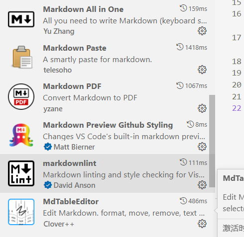
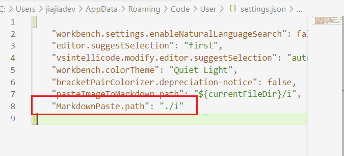
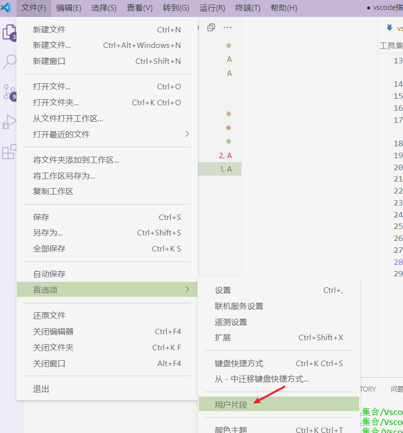
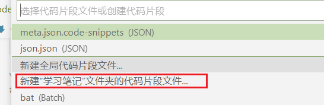
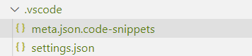
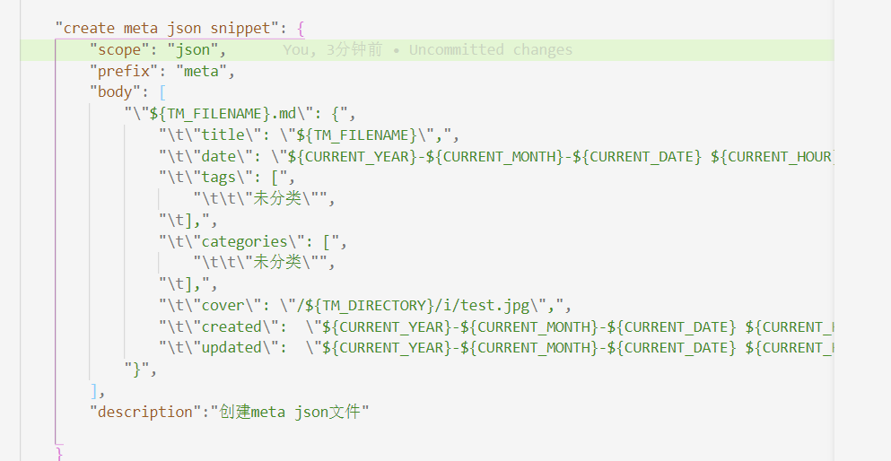

以前写笔记，本地的cherry,edaily,oneNote都用过，然后有道云，为知，印象笔记，notion等，这些之间不能相互转换，用多个笔记软件管理这些新知旧识，总感非常灵散，而且手机，电脑端要装七七八八的软件，占空间不说，还有广告！！！ 有些动不动就死给你看。体验上非常不便。天下大势，合久必分，分久必合。

某个下午，坐在一棵树下，一个机灵砸中了我的脑袋，突然想到都是编辑器，刚好vscode不就是个编辑器吗？只要它插件够多，不行还能自己造插件。为何不用它实现大一统呢？

## 1. 选择vscode的原因

 1.1 vscode是一个编译器，免费开源。
 1.2 有很多插件可以扩展。
 1.3 没有插件，可以自己造插件。
 1.4 既是编辑器，又可以化身为IDE。(看别人代码，总是要记些笔记的吧)。

## 2. 如何实现跨端的查看呢

笔记写完后，推送到github仓库中，然后利用github的Action自动发布博客文章。

## 3. 步骤

### 3.1  插件安装

### 3.2 配置图片保存的路径

CTRL＋，打开工作区，然后

### 3.3 meta.json元数据代码片段

创建_meta.json文件,然后输入meta就会自动生成片段。
